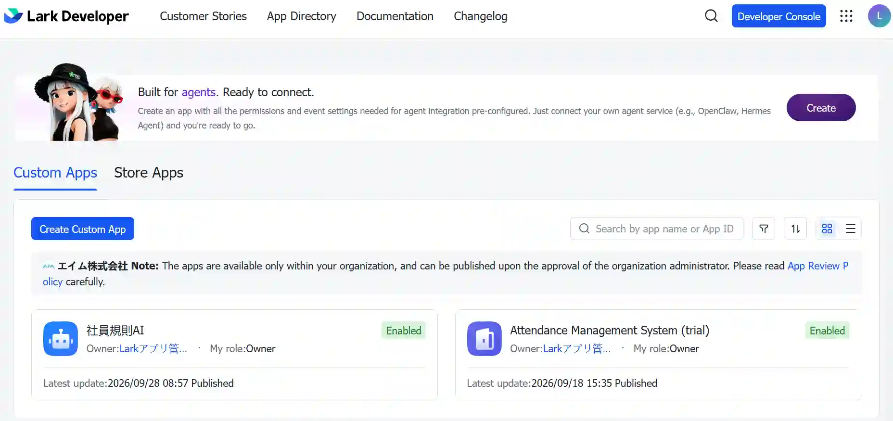
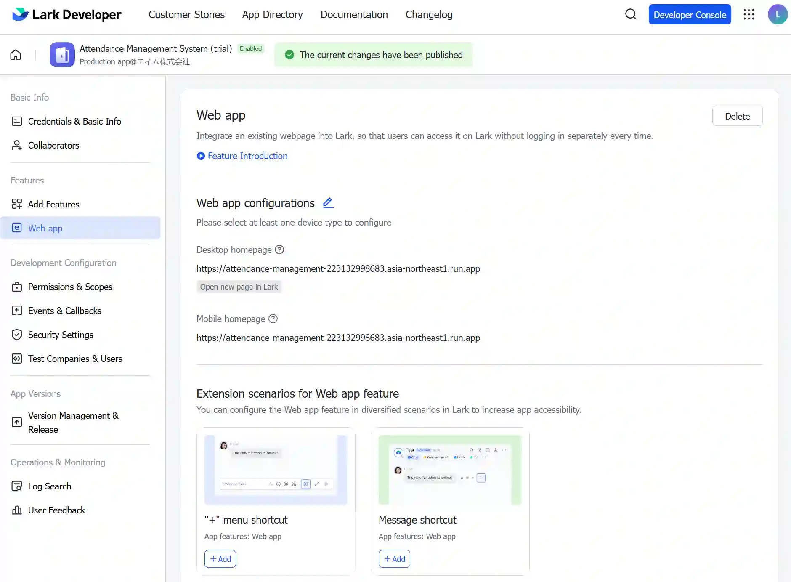

# Lark DeveloperでCustom Appを作成してLarkから勤怠システムにアクセス

# デベロッパー側

Lark Developer Consoleにアクセス

以下のアプリ名が対象

```
EN: Attendance Management System (trial)
JP: 勤怠管理システム(トライアル中)
```

<a href="./img/001.webp">
  
</a>

Web Appとして作成

Google Cloudでデプロイ済みの公開URLを指定している

つまりは、そこにアクセスするとフロントエンド（ログイン画面）が表示される

<a href="./img/002.webp">
  
</a>

# 利用者側

詳しくは以下を参照

[利用者ガイド](../guide/利用者ガイド.md)