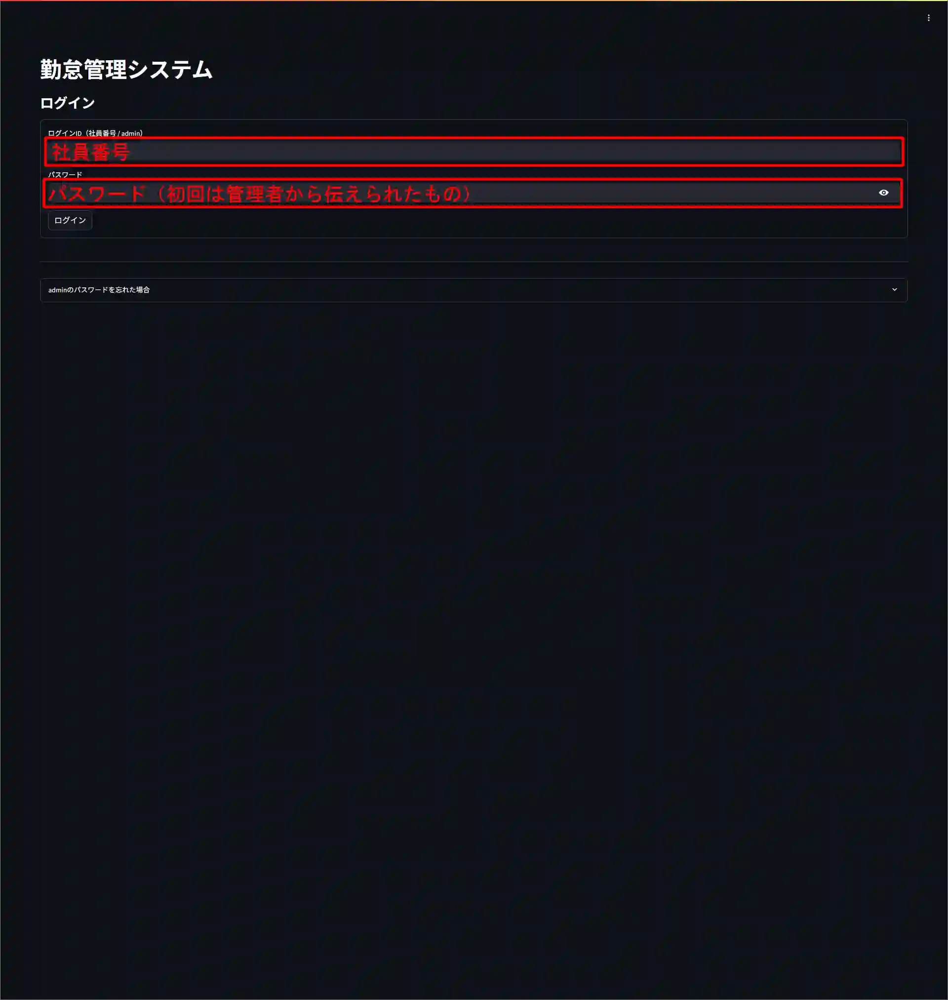
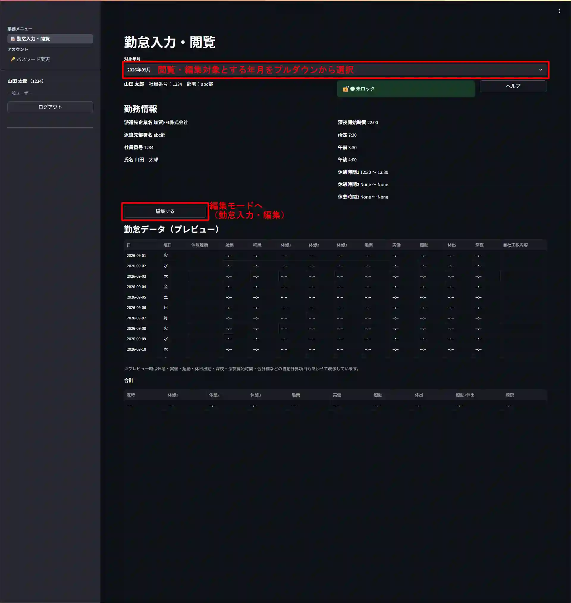
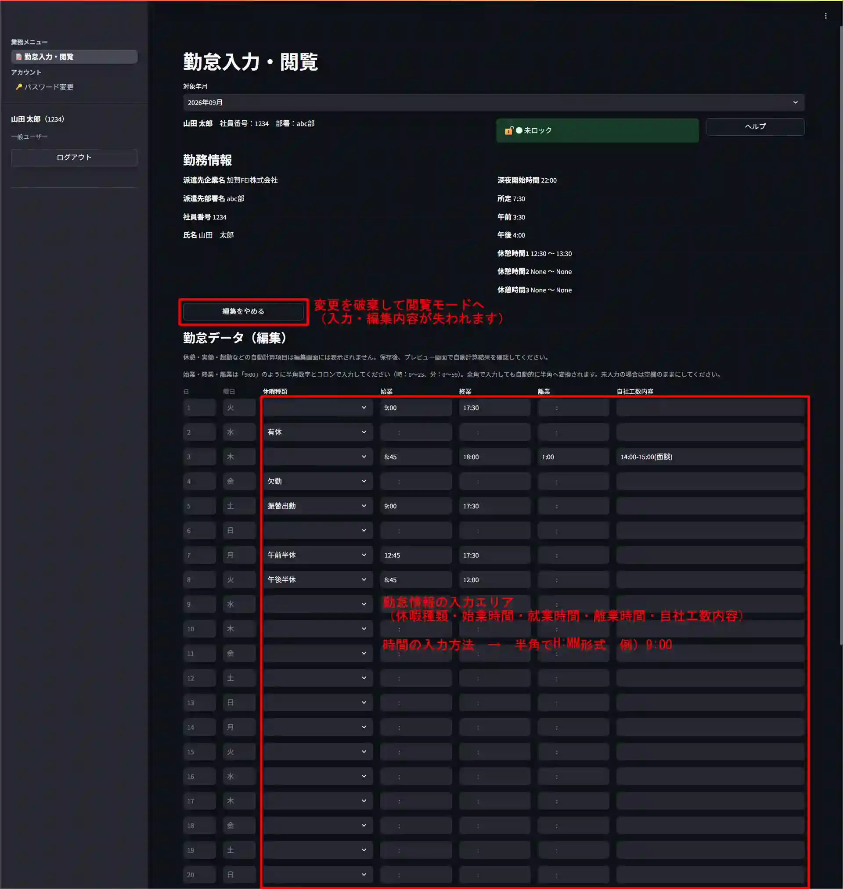
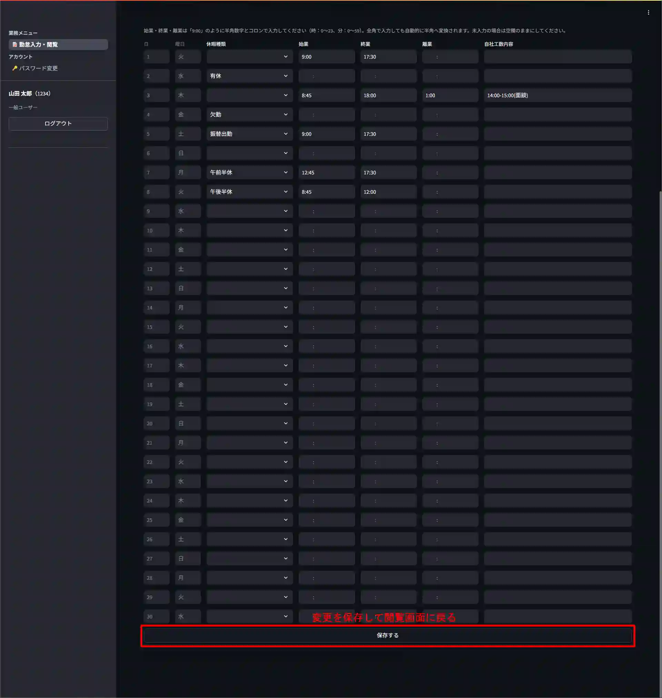
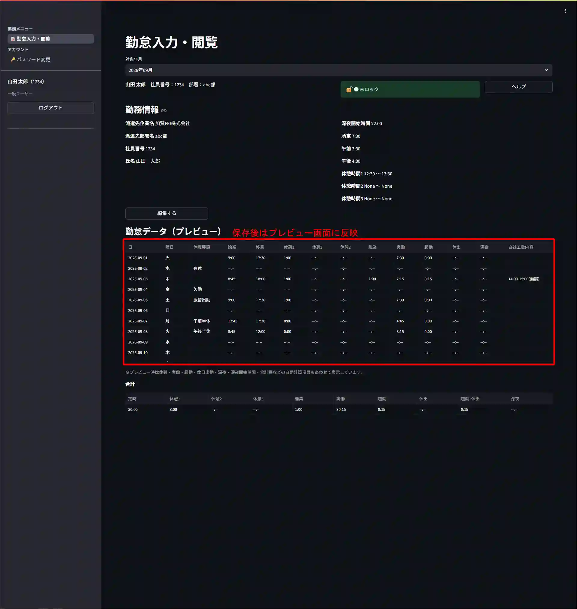
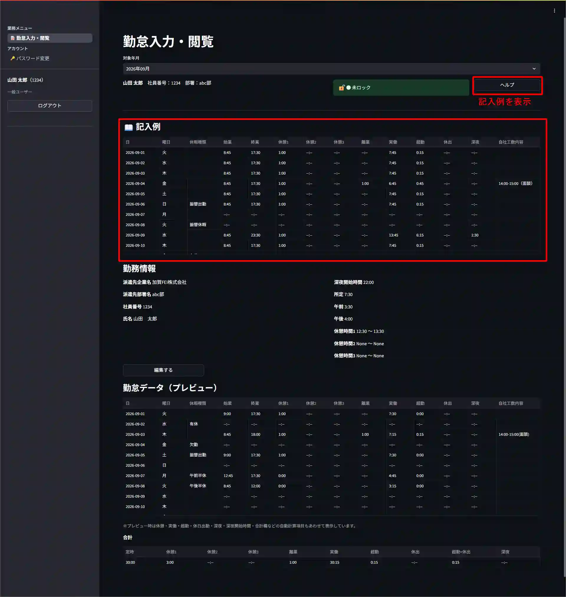
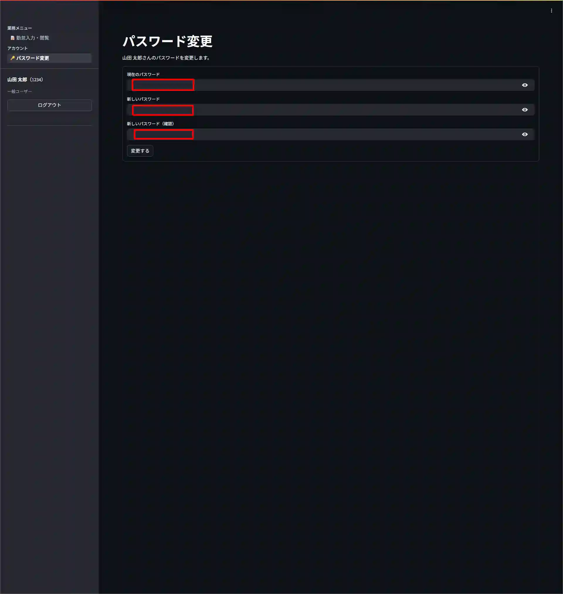

# 説明用

1. ログイン画面
2. 勤怠入力・閲覧画面
   - 閲覧モード
   - 編集モード
3. パスワード変更画面

## 1. ログイン画面

## 2. 勤怠入力・閲覧画面

### 閲覧モード

### 編集モード

### 閲覧モード（保存ボタン押下後）

### 閲覧モード（ヘルプボタンを押した際）

- Excelの `記入例` シートを表示しています

## 3. パスワード変更画面

