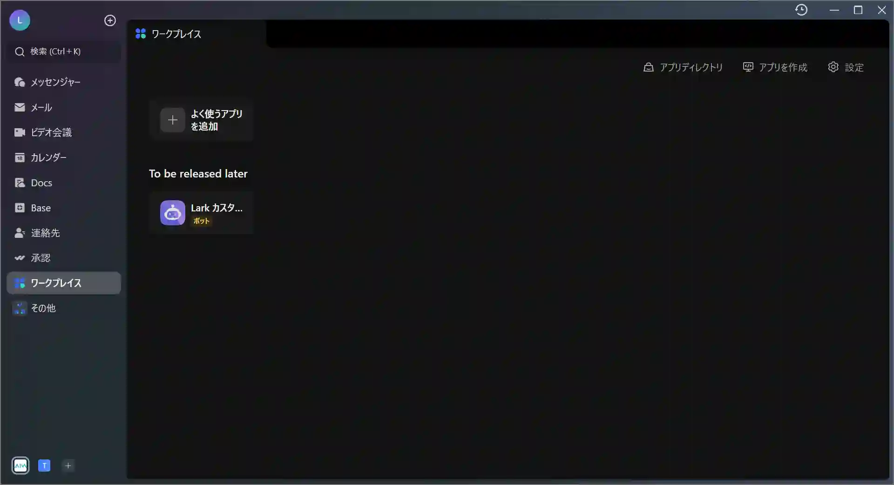
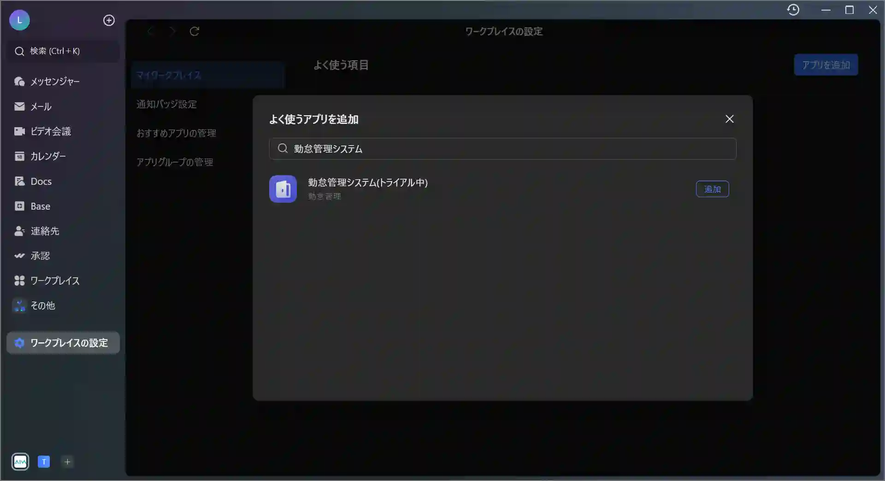
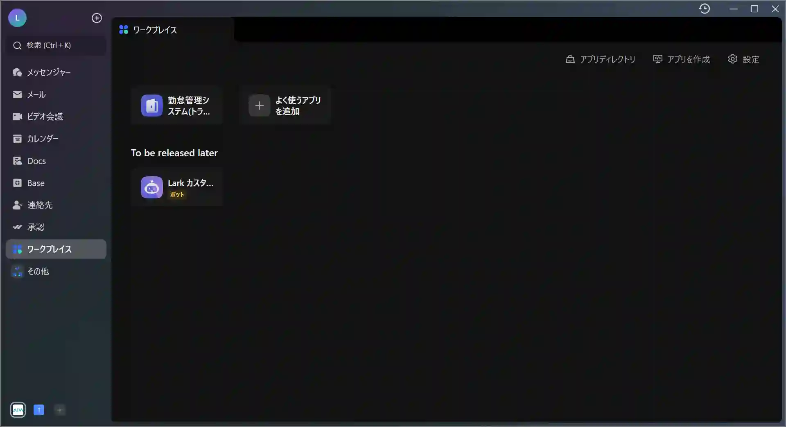
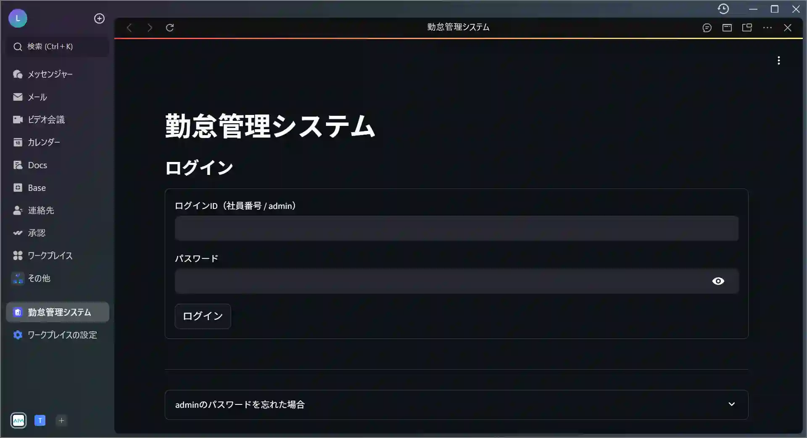
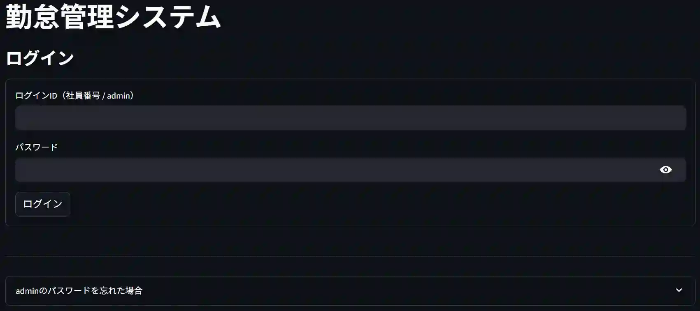
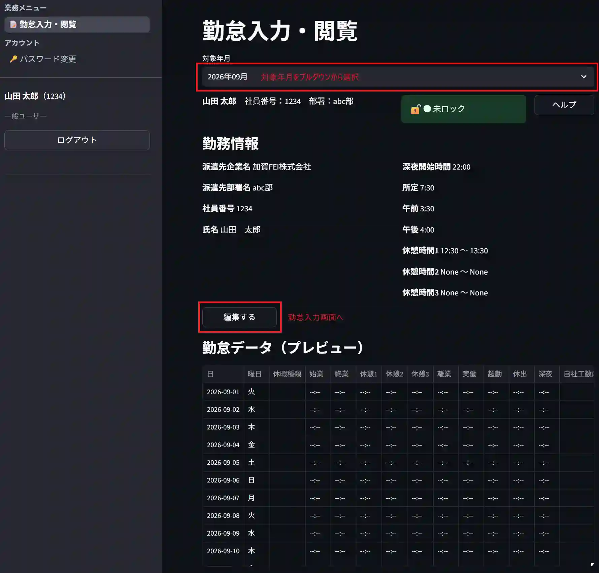
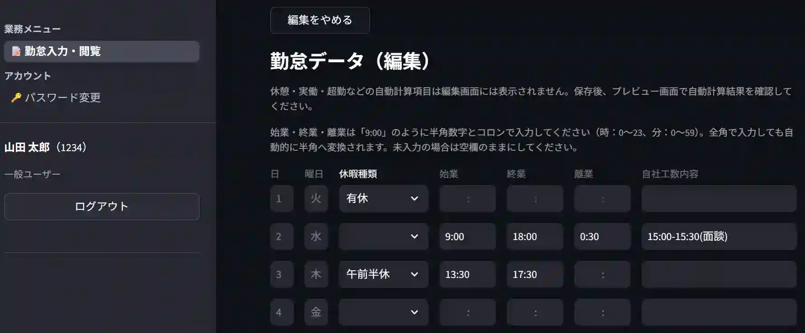
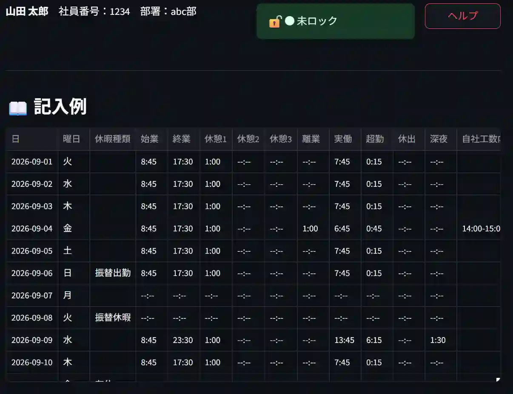
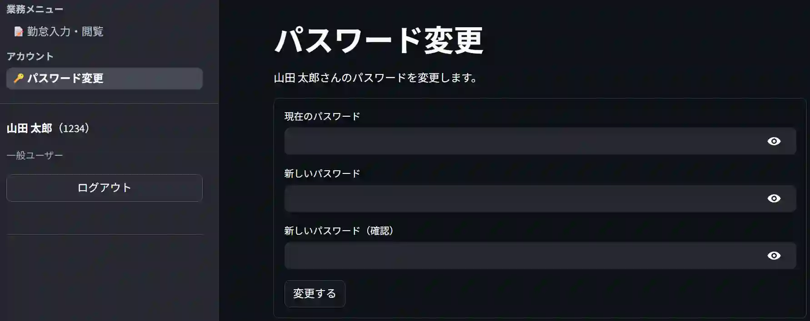
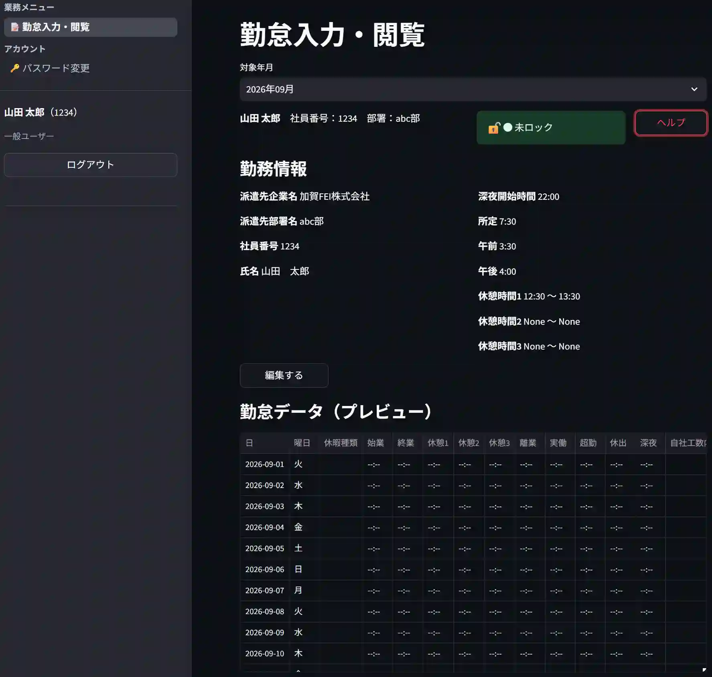

# 勤怠管理システム 利用者ガイド

本ドキュメントは、勤怠管理システムを利用する**一般ユーザー**向けのガイドです。ログイン方法、勤怠の入力・確認方法、パスワード変更などをまとめています。

---

## 目次

- [勤怠管理システム 利用者ガイド](#勤怠管理システム-利用者ガイド)
  - [目次](#目次)
  - [1. はじめに（ログイン前に）](#1-はじめにログイン前に)
  - [2. 勤怠システムのページへアクセス](#2-勤怠システムのページへアクセス)
  - [3. 初回ログインとパスワード変更](#3-初回ログインとパスワード変更)
  - [4. 勤怠の入力方法](#4-勤怠の入力方法)
    - [4.1 対象月の選択](#41-対象月の選択)
    - [4.2 入力する項目](#42-入力する項目)
    - [4.3 保存](#43-保存)
  - [5. 入力内容の修正](#5-入力内容の修正)
  - [6. 入力例（ヘルプ）の確認方法](#6-入力例ヘルプの確認方法)
  - [7. パスワードの変更](#7-パスワードの変更)
  - [8. パスワードを忘れた場合](#8-パスワードを忘れた場合)
  - [9. 画面一覧](#9-画面一覧)
    - [ログイン画面](#ログイン画面)
    - [勤怠閲覧・編集画面](#勤怠閲覧編集画面)
    - [パスワード変更画面](#パスワード変更画面)

---

## 1. はじめに（ログイン前に）

このシステムでは、月ごとの勤怠（始業・終業時刻、休暇など）をブラウザから入力します。入力した内容は、社内の勤怠表（Excel形式）として管理者側で保管・確認されます。

ログインには、あらかじめ管理者から発行された**社員番号**と**初期パスワード**が必要です。まだ受け取っていない場合は、管理者に確認してください。

システムへアクセスするURLも、あわせて管理者から案内されます。

---

## 2. 勤怠システムのページへアクセス

Larkからアクセスする方法

`ワークプレイス` の `よく使うアプリを追加` を選択

↓

`勤怠システム` と検索

↓

追加された `勤怠システム` を開く

↓

勤怠システムのページにアクセス可能

ブラウザから直接URLにアクセスしても同じ画面が開きます

---

## 3. 初回ログインとパスワード変更

- ログインに必要なもの
  - 社員番号
  - パスワード

ログインIDに**社員番号**、パスワードに**管理者から伝えられた初期パスワード**を入力します。

> ログインに成功したら、最初に **パスワードを変更** を推奨します（7章）。

---

## 4. 勤怠の入力方法

### 4.1 対象月の選択

ログイン後、勤怠入力画面で対象の年月を選択します。まだその月の勤怠ファイルが作成されていない場合、対象月を選択した時点で自動的に新しい入力用ファイルが作成されます（初回は少し時間がかかる場合があります）。

> 選択できる年月には範囲があります（サービス開始月より前の月は選べません）。

### 4.2 入力する項目

主に以下の項目を入力します（実際の項目・レイアウトは会社の勤怠表フォーマットに準じます）。

| 項目 | 内容 |
|---|---|
| 始業時間 | 出勤時刻。`H:MM`形式のテキスト欄に直接入力します（例：`9:00`） |
| 終業時間 | 退勤時刻。同じく`H:MM`形式で入力します |
| 離業時間 | 中抜け・外出時間がある場合に入力します |
| 休暇種類 | 有給・特別休暇など、該当する休暇をプルダウンから選択します |
| 自社工数内容 | 業務内容・工数に関する備考欄です |

氏名・社員番号・部署名・対象月はシステム側で自動的に設定されるため、自分で入力する必要はありません。

時刻の入力欄はテキストボックス形式です。`9:00`のように、時と分をコロン区切りで入力してください。

### 4.3 保存

入力後は、画面の保存操作を行ってください。保存されるまでは入力内容が確定されません。ページを閉じる前に、保存が完了したことを確認してください。

---

## 5. 入力内容の修正

一度保存した内容は、その月が**ロックされていない限り**、何度でも自分で修正できます。

- 「編集する」ボタンが押せない・グレーアウトしている場合、対象月が管理者によってロックされている可能性があります。この場合は自分で修正できないため、管理者にロック解除を依頼してください。
- 月次の締め処理後は、管理者側で内容確認のためにロックされることがあります。

---

## 6. 入力例（ヘルプ）の確認方法

入力方法に迷った場合、画面のヘルプボタンから入力例を参照できます。どのように記入すればよいか分からない項目がある場合は、まずこちらを確認してください。

---

## 7. パスワードの変更

1. 「パスワード変更」画面を開きます。
2. 現在のパスワードと、新しいパスワードを入力します。
3. 新しいパスワードは以下の条件を満たす必要があります。
   - 8文字以上
   - 英大文字・英小文字・数字のうち **2種類以上** を含む
4. 変更を保存します。

パスワードは他人に共有せず、忘れないように安全に管理してください。忘れてしまった場合は、自分では再設定できないため管理者に連絡してください。

---

## 8. パスワードを忘れた場合

- パスワードを忘た場合は、管理者に連絡してください
- 管理者がパスワードを再設定し、そのパスワードを利用者に伝えます

---

## 9. 画面一覧

### ログイン画面

### 勤怠閲覧・編集画面

### パスワード変更画面

