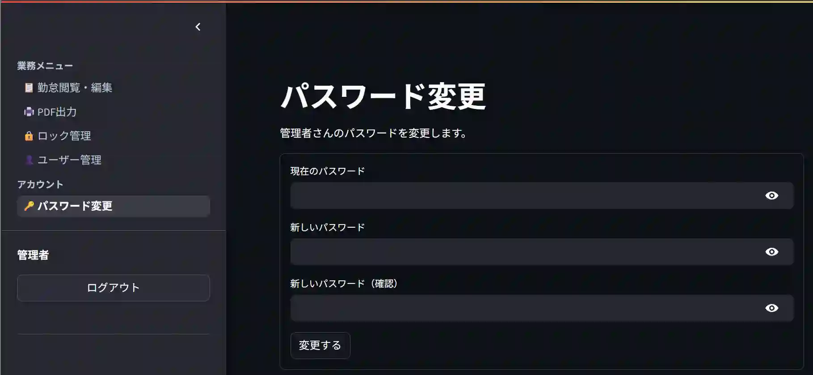
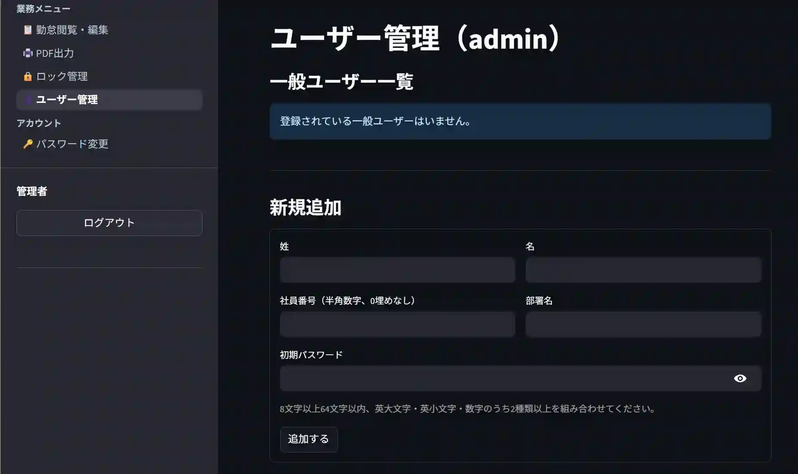
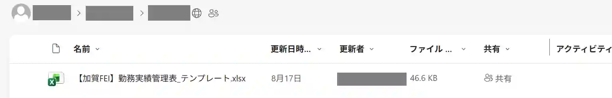
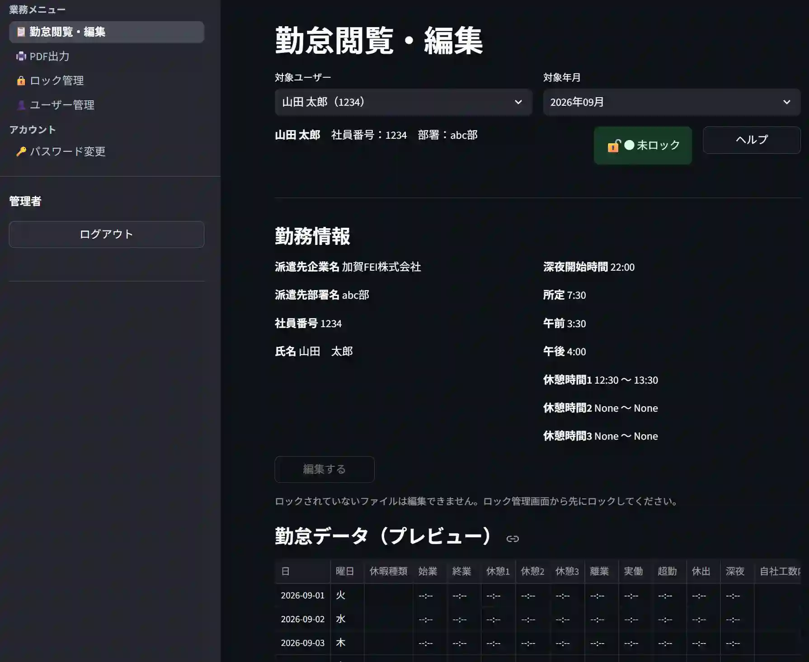
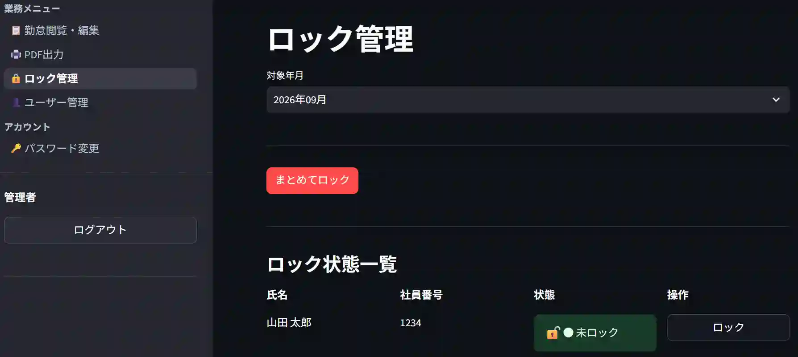
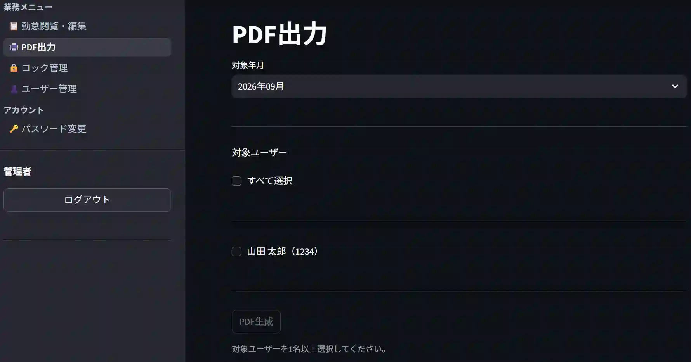
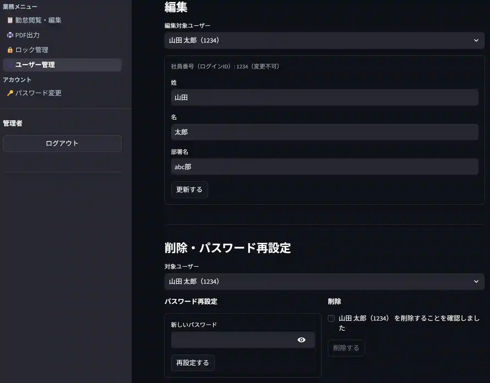
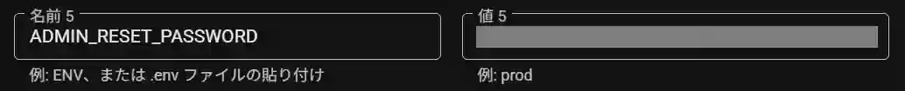
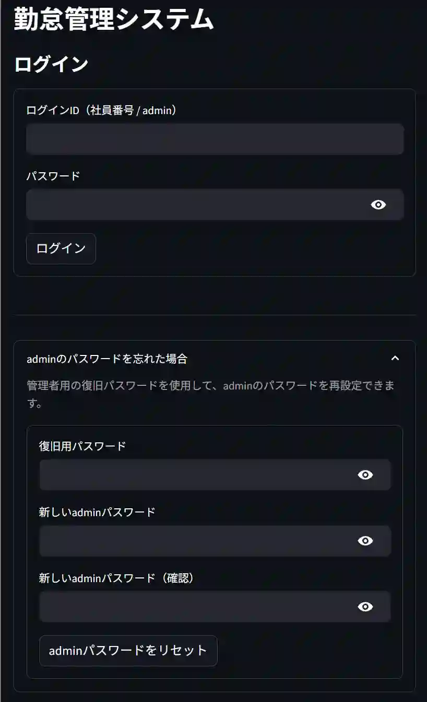
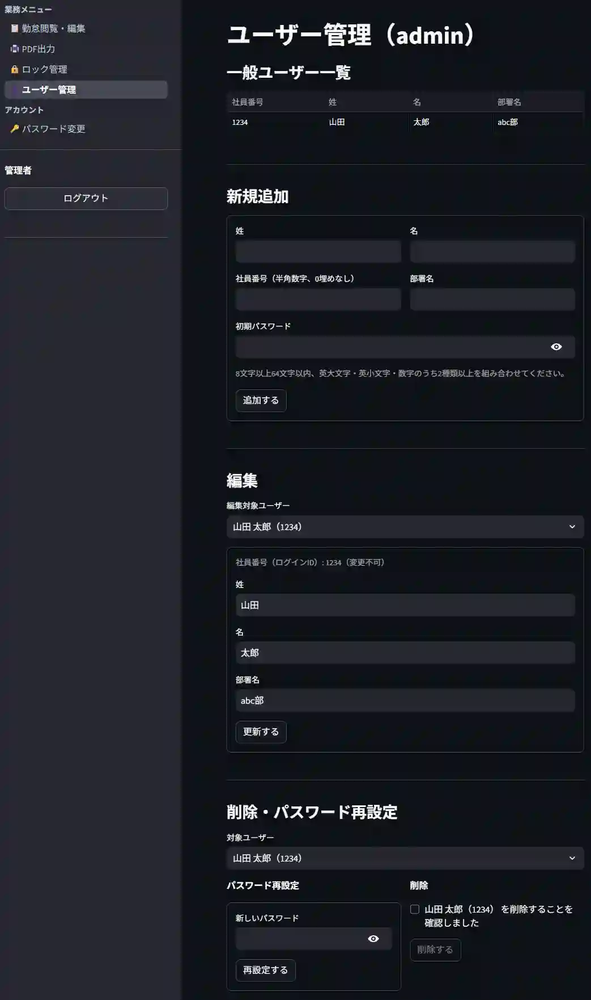

# 勤怠管理システム 管理者ガイド

本ドキュメントは、勤怠管理システムの**管理者（admin）**向けの運用ガイドです。Cloud Runへのデプロイ完了後、実際に社内で運用を開始するための初期設定手順と、日常的な管理業務の操作方法をまとめています。

---

## 目次

- [勤怠管理システム 管理者ガイド](#勤怠管理システム-管理者ガイド)
  - [目次](#目次)
  - [1. 運用開始前チェックリスト](#1-運用開始前チェックリスト)
  - [2. 初回ログイン](#2-初回ログイン)
  - [3. adminパスワードの変更（最優先）](#3-adminパスワードの変更最優先)
  - [4. ユーザーの追加（運用開始時に必須）](#4-ユーザーの追加運用開始時に必須)
    - [4.1 登録する項目](#41-登録する項目)
    - [4.2 登録手順](#42-登録手順)
    - [4.3 ユーザーへの初期案内](#43-ユーザーへの初期案内)
  - [5. テンプレートExcelファイルの配置確認](#5-テンプレートexcelファイルの配置確認)
  - [6. 日常の管理業務](#6-日常の管理業務)
    - [6.1 全ユーザーの勤怠閲覧・編集](#61-全ユーザーの勤怠閲覧編集)
    - [6.2 編集ロックの管理](#62-編集ロックの管理)
    - [6.3 PDF出力](#63-pdf出力)
    - [6.4 ユーザー管理（追加・変更・退職者対応）](#64-ユーザー管理追加変更退職者対応)
  - [7. 月次運用の流れ（例）](#7-月次運用の流れ例)
  - [8. adminパスワードを忘れた場合の復旧](#8-adminパスワードを忘れた場合の復旧)
    - [事前準備（システム担当者による設定）](#事前準備システム担当者による設定)
    - [復旧手順](#復旧手順)
    - [注意点](#注意点)
  - [9. 画面一覧](#9-画面一覧)
    - [ログイン画面](#ログイン画面)
    - [勤怠閲覧・編集画面](#勤怠閲覧編集画面)
    - [PDF出力画面](#pdf出力画面)
    - [ロック管理画面](#ロック管理画面)
    - [ユーザー管理画面](#ユーザー管理画面)
    - [パスワード変更画面](#パスワード変更画面)

---

## 1. 運用開始前チェックリスト

Cloud Runへのデプロイが完了した直後、利用者に案内する前に以下を必ず行ってください。

- [ ] adminアカウントで初回ログインできることを確認した（2章）
- [ ] adminパスワードを初期パスワードから変更した（3章）
- [ ] 利用者（一般ユーザー）を全員登録した（4章）
- [ ] テンプレートExcelファイルが正しく配置されていることを確認した（5章）
- [ ] 一般ユーザーのうち1名で試しにログイン・勤怠入力ができることを確認した
- [ ] adminパスワードの復旧用パスワード（`ADMIN_RESET_PASSWORD`）がシステム担当者により設定されており、その値を確認・保管した（8章）

---

## 2. 初回ログイン

1. Cloud Runで発行されたURL（システム担当者から共有されます）にブラウザでアクセスします。
2. ログインIDに `admin` を入力します。
3. パスワードは、デプロイ時に設定された初期パスワード（環境設定の`INITIAL_ADMIN_PASSWORD`の値）を入力します。このパスワードはシステム担当者に確認してください。
4. ログインに成功すると、管理者用の画面が表示されます。

> **重要**：初期パスワードは仮のものです。ログインできたら、他の作業より先に必ずパスワードを変更してください（次章）。

---

## 3. adminパスワードの変更（最優先）

1. 画面から「パスワード変更」を開きます。
2. 現在のパスワード（初期パスワード）と、新しいパスワードを入力します。
3. 新しいパスワードは以下のポリシーを満たす必要があります。
   - 8文字以上
   - 英大文字・英小文字・数字のうち **2種類以上** を含む
4. 変更を保存します。

このパスワードは今後、admin としてログインするたびに使用します。安全な場所に保管し、他の担当者と共有する場合も適切に管理してください。

---

## 4. ユーザーの追加（運用開始時に必須）

**利用者（一般ユーザー）は、admin が事前に登録しないとログインできません。** 運用を開始する前に、対象となる社員全員をこの手順で登録してください。

### 4.1 登録する項目

ユーザー登録には以下の情報が必要です。事前に一覧（社員番号・氏名・所属部署）を用意しておくとスムーズです。

| 項目 | 内容 |
|---|---|
| 社員番号 | ログインIDとして使用されます。重複不可 |
| 氏名 | 勤怠表（Excel）の氏名欄に自動反映されます |
| 部署名 | 勤怠表（Excel）の部署欄に自動反映されます |
| 初期パスワード | 利用者が初回ログイン時に使用するパスワード |

> **重要**：運用開始前に社員番号・氏名・部署名を正しく設定してください

### 4.2 登録手順

1. 「ユーザー管理」画面を開きます。
2. 新規登録フォームに、社員番号・氏名・部署名・初期パスワードを入力します。
3. 登録を実行します。
4. 登録した社員番号・初期パスワードを、当該利用者に安全な方法で伝達します（口頭、封書、個別のメッセージなど。メール等で平文のまま一括送信することは避けてください）。

複数人をまとめて登録する場合は、この手順を人数分繰り返します。

### 4.3 ユーザーへの初期案内

利用者への案内には、[`利用者ガイド.md`](./利用者ガイド.md) を合わせて共有してください。ログイン方法・パスワード変更・勤怠入力の手順が記載されています。

利用者にも、初回ログイン後すぐに初期パスワードを変更するよう案内してください（利用者ガイド2章参照）。

---

## 5. テンプレートExcelファイルの配置確認

月次の勤怠Excelファイルは、ユーザーが対象月へ初めてアクセスした瞬間に、テンプレートファイルから自動生成されます。テンプレートが正しい場所に置かれていないと、利用者が勤怠入力画面を開いた際に「テンプレートファイルがOneDrive上に見つかりません」というエラーになります。

- テンプレートの配置場所・ファイル名の要件は [`README.md`](./README.md) の「テンプレートExcelファイルの設置方法」の章を参照してください。
- 配置の確認は、実際に一般ユーザー（自分のテストアカウント等）でログインし、勤怠入力画面で対象月を開いてみるのが最も確実です。正常であれば空欄の月次ファイルがその場で生成されます。

---

## 6. 日常の管理業務

### 6.1 全ユーザーの勤怠閲覧・編集

「勤怠閲覧・編集」画面から、対象ユーザー・対象月を選択すると、そのユーザーの勤怠内容を確認できます。

- **admin による編集は、対象ファイルが「ロック中」の状態のときのみ可能**です（6.2節）。ロックされていない（利用者が編集可能な）状態のファイルは、admin であっても直接編集できません。
- 内容を修正する必要がある場合は、先に対象月をロックしてから編集してください。

### 6.2 編集ロックの管理

「ロック管理」画面では、対象ユーザー・対象月ごとに、勤怠ファイルの編集をロック／解除できます。

- **ロック中**：一般ユーザーはその月の勤怠を編集できません。admin のみが編集できます。締め処理後の内容確定や、admin側での修正時に使用します。
- **ロック解除中（通常時）**：一般ユーザーが自分の勤怠を編集できます。

一番上のプルダウンから年月を選択します。 
まとめてロックボタンで該当年月のすべてのユーザーをロックします。 
ユーザー名の右側のロックボタンで個別にロックまたはロック解除ができます。

一般ユーザーから「入力を修正したいが編集できない」という問い合わせがあった場合は、対象月がロックされていないか確認してください。

### 6.3 PDF出力

「PDF出力」画面から、対象ユーザー・対象月（または複数対象）を選択し、勤怠表をPDF形式で出力できます。紙で保管する必要がある場合や、社外に提出する場合などに使用します。

### 6.4 ユーザー管理（追加・変更・退職者対応）

「ユーザー管理」画面では、新規登録（4章）のほか、既存ユーザーの情報変更や、退職者・異動者への対応も行います。運用ルールについては、まだ画面上の詳細な仕様変更点があり得るため、実際の画面表示内容に従って対応してください。判断に迷う場合は、開発・運用担当者に確認してください。

---

## 7. 月次運用の流れ（例）

あくまで一例です。組織の運用ルールに合わせて調整してください。

1. **月初〜月中**：利用者が各自、日々の勤怠を入力する。
2. **月末〜翌月初**：利用者が当月分の入力を完了させる（締め日を社内で周知しておく）。
3. **締め日以降**：admin が対象月・対象ユーザーをロックし、内容を確認する。
4. 内容に不備があれば、admin がロック中の状態のまま修正するか、一時的にロックを解除して利用者本人に修正を依頼する。
5. 確定後、必要に応じて PDF出力を行い、保管・提出する。

---

## 8. adminパスワードを忘れた場合の復旧

adminパスワードを紛失し、通常のログインができなくなった場合に備えて、専用の復旧手順が用意されています。

### 事前準備（システム担当者による設定）

システム担当者が、環境変数 `ADMIN_RESET_PASSWORD` に**復旧用パスワード**をあらかじめ設定しておく必要があります。この値は `INITIAL_ADMIN_PASSWORD`（初回起動時のみ有効な初期パスワード）とは別物で、**いつでも・何度でも**admin復旧に使用できます。

- この復旧用パスワードが何であるかは、事前にシステム担当者に確認し、admin業務を行う担当者間で安全に共有・保管しておいてください（付箋やチャットへの平文貼り付けなど、漏えいしやすい方法は避けてください）。
- `ADMIN_RESET_PASSWORD` が設定されていない環境では、この復旧手順自体が使用できません。

### 復旧手順

1. ログイン画面を開きます（通常のログインフォームと同じ画面です）。
2. 「adminのパスワードを忘れた場合」という項目を開きます。
3. 以下を入力します。
   - **復旧用パスワード**：システム担当者から共有されている `ADMIN_RESET_PASSWORD` の値
   - **新しいadminパスワード**
   - **新しいadminパスワード（確認）**：確認のため再入力
4. 新しいパスワードは以下の条件を満たす必要があります（3章の通常のパスワード変更と同じ条件です）。
   - 8文字以上
   - 英大文字・英小文字・数字のうち2種類以上を含む
5. 「adminパスワードをリセット」を実行します。成功すると、新しいパスワードで通常通りログインできるようになります。

### 注意点

- **この操作はadminアカウント専用です。** 一般ユーザーがパスワードを忘れた場合は、この方法ではなく、admin が「ユーザー管理」画面から本人のパスワードを再設定してください（6.4節）。
- 復旧用パスワード（`ADMIN_RESET_PASSWORD`）を知っている人は誰でもadminパスワードを再設定できてしまいます。この値の管理・共有範囲は組織のルールに従って厳重に行ってください。
- 復旧用パスワード自体が分からない・忘れてしまった場合は、システム担当者に確認してください（環境変数の値を変更するにはCloud Runの再デプロイが必要です）。

---

## 9. 画面一覧

### ログイン画面

### 勤怠閲覧・編集画面

### PDF出力画面

### ロック管理画面

### ユーザー管理画面

### パスワード変更画面

